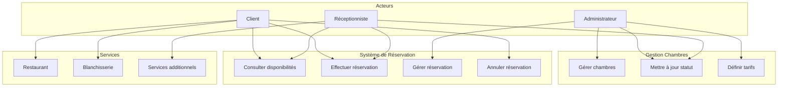
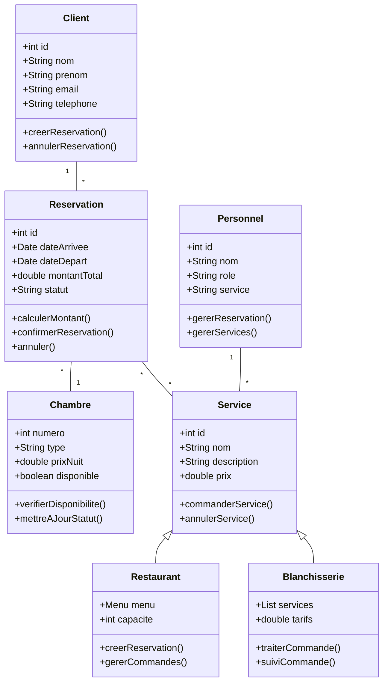
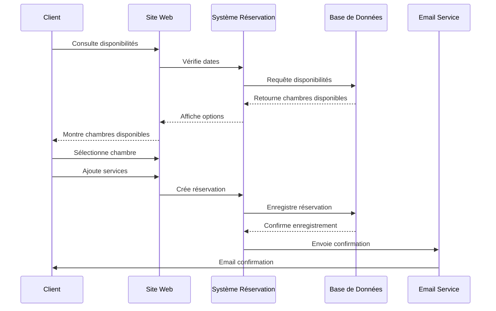
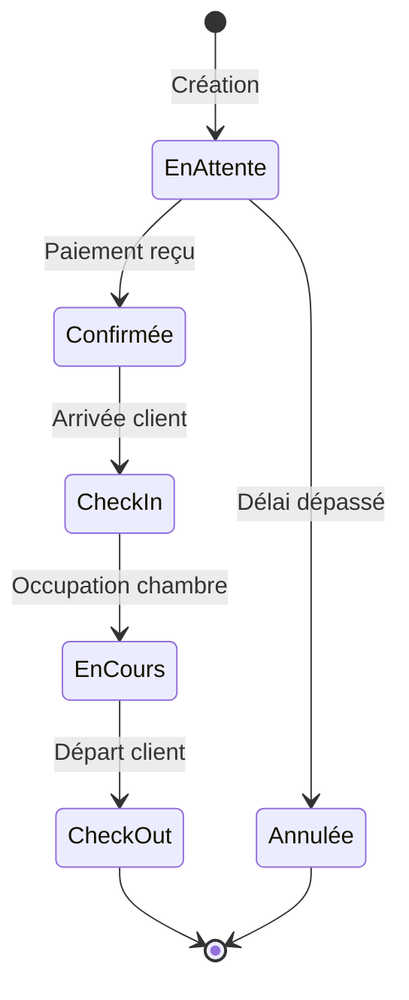
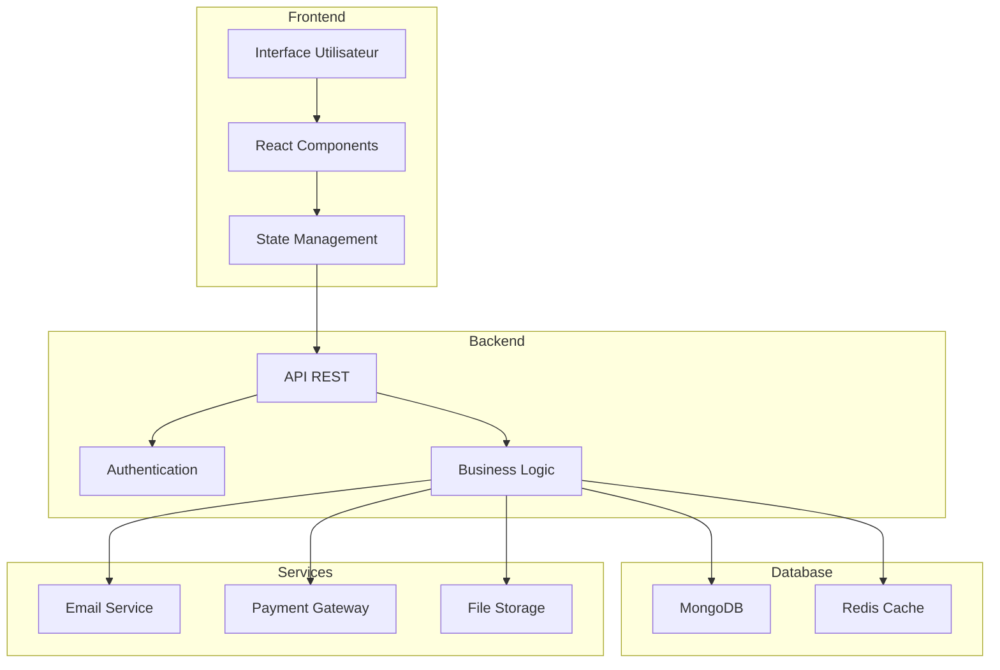
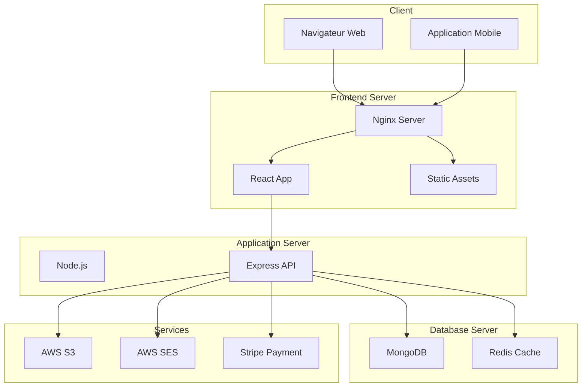

# Diagrammes UML du Projet

## 1. Diagramme de Cas d'Utilisation

### 1.1 Description des Acteurs

#### Client
- **Rôle** : Utilisateur principal du système
- **Responsabilités** :
  - Consulter les disponibilités des chambres
  - Effectuer des réservations
  - Gérer ses réservations existantes
  - Accéder aux services de l'hôtel
  - Consulter l'historique de ses séjours

#### Administrateur
- **Rôle** : Gestionnaire du système
- **Responsabilités** :
  - Gérer les chambres et leurs caractéristiques
  - Définir les tarifs et promotions
  - Gérer les comptes utilisateurs
  - Superviser les réservations
  - Accéder aux statistiques et rapports

#### Réceptionniste
- **Rôle** : Interface entre l'hôtel et les clients
- **Responsabilités** :
  - Gérer les check-in et check-out
  - Traiter les demandes spéciales
  - Gérer les services additionnels
  - Assurer le suivi des réservations

### 1.2 Description des Cas d'Utilisation Principaux

#### Gestion des Réservations
1. **Consulter les disponibilités**
   - Préconditions : Accès au système
   - Flux principal :
     * Saisie des dates de séjour
     * Sélection du type de chambre
     * Vérification de la disponibilité
   - Postconditions : Affichage des options disponibles

2. **Effectuer une réservation**
   - Préconditions : Chambres disponibles
   - Flux principal :
     * Sélection de la chambre
     * Saisie des informations personnelles
     * Choix des services additionnels
     * Confirmation du paiement
   - Postconditions : Réservation confirmée

3. **Gérer une réservation existante**
   - Préconditions : Réservation active
   - Flux principal :
     * Modification des dates
     * Ajout/suppression de services
     * Mise à jour des informations
   - Postconditions : Réservation mise à jour

## 2. Diagramme de Classes

### 2.1 Description Détaillée des Classes

#### Client
- **Attributs** :
  * id : Identifiant unique
  * nom : Nom du client
  * prenom : Prénom du client
  * email : Adresse email
  * telephone : Numéro de téléphone
  * adresse : Adresse postale
  * preferences : Préférences spéciales
- **Méthodes** :
  * creerReservation() : Création d'une nouvelle réservation
  * annulerReservation() : Annulation d'une réservation existante
  * modifierProfil() : Mise à jour des informations personnelles
  * consulterHistorique() : Accès à l'historique des séjours

#### Reservation
- **Attributs** :
  * id : Identifiant unique
  * dateArrivee : Date d'arrivée
  * dateDepart : Date de départ
  * montantTotal : Coût total du séjour
  * statut : État de la réservation
  * nombrePersonnes : Nombre de personnes
  * servicesAdditionnels : Liste des services réservés
- **Méthodes** :
  * calculerMontant() : Calcul du coût total
  * confirmerReservation() : Confirmation de la réservation
  * annuler() : Annulation avec gestion des remboursements
  * modifierDates() : Modification des dates de séjour

#### Chambre
- **Attributs** :
  * numero : Numéro de chambre
  * type : Type de chambre (Simple, Double, Suite)
  * prixNuit : Tarif par nuit
  * disponible : État de disponibilité
  * caracteristiques : Équipements et options
  * etage : Niveau dans l'hôtel
- **Méthodes** :
  * verifierDisponibilite() : Vérification des dates disponibles
  * mettreAJourStatut() : Mise à jour de l'état
  * calculerPrix() : Calcul du prix selon la période
  * planifierMaintenance() : Programmation de l'entretien

### 2.2 Relations entre Classes

#### Associations
1. **Client - Reservation** : 
   - Cardinalité : 1..* (un client peut avoir plusieurs réservations)
   - Attributs d'association : dateCreation, canalReservation

2. **Reservation - Chambre** :
   - Cardinalité : *..1 (plusieurs réservations pour une chambre)
   - Attributs d'association : dureeOccupation, tarifApplique

3. **Reservation - Service** :
   - Cardinalité : *..* (relation many-to-many)
   - Classe d'association : ReservationService

#### Hiérarchies
1. **Service (classe abstraite)**
   - Restaurant (spécialisation)
   - Blanchisserie (spécialisation)
   - SpaFitness (spécialisation)

## 3. Diagramme de Séquence - Processus de Réservation

### 3.1 Description des Interactions

#### Phase 1 : Recherche de Disponibilité
1. **Client → Site Web**
   - Action : Saisie des critères de recherche
   - Données : Dates, type de chambre, nombre de personnes

2. **Site Web → Système Réservation**
   - Action : Vérification des disponibilités
   - Traitement : Filtrage selon critères

3. **Système Réservation → Base de Données**
   - Action : Requête de disponibilité
   - Optimisation : Utilisation de cache Redis

#### Phase 2 : Processus de Réservation
1. **Sélection et Configuration**
   - Choix de la chambre
   - Sélection des services additionnels
   - Calcul du prix total

2. **Validation et Paiement**
   - Saisie des informations personnelles
   - Traitement du paiement
   - Confirmation de la réservation

3. **Confirmation et Notification**
   - Enregistrement en base de données
   - Envoi de confirmation par email
   - Mise à jour du planning

### 3.2 Flux de Données

## 4. Diagramme d'État - État d'une Réservation

### 4.1 États Possibles d'une Réservation

#### 1. En Attente
- **Description** : Réservation créée mais non confirmée
- **Conditions de transition** :
  * Vers Confirmée : Paiement reçu
  * Vers Annulée : Délai de paiement dépassé
- **Actions associées** :
  * Envoi de rappels
  * Vérification du paiement

#### 2. Confirmée
- **Description** : Réservation validée et payée
- **Conditions de transition** :
  * Vers Check-in : Arrivée du client
  * Vers Annulée : Demande d'annulation
- **Actions associées** :
  * Préparation de la chambre
  * Planification des services

#### 3. Check-in
- **Description** : Client arrivé et enregistré
- **Conditions de transition** :
  * Vers En Cours : Installation en chambre
- **Actions associées** :
  * Vérification des documents
  * Remise des clés

#### 4. En Cours
- **Description** : Séjour en cours
- **Conditions de transition** :
  * Vers Check-out : Fin du séjour
- **Actions associées** :
  * Suivi des services
  * Gestion des demandes

#### 5. Check-out
- **Description** : Fin du séjour
- **Conditions de transition** :
  * Vers Terminée : Chambre libérée
- **Actions associées** :
  * Facturation finale
  * Retour des clés

### 4.2 Transitions et Événements

## 5. Diagramme de Composants

### 5.1 Description des Composants

#### Frontend
1. **Interface Utilisateur (UI)**
   - Technologies : React, Tailwind CSS
   - Responsabilités :
     * Affichage des pages
     * Gestion des formulaires
     * Interactions utilisateur
     * Responsive design

2. **State Management**
   - Technologies : Redux, Context API
   - Responsabilités :
     * Gestion de l'état global
     * Cache local
     * Synchronisation des données

#### Backend
1. **API REST**
   - Technologies : Express.js
   - Endpoints principaux :
     * /api/reservations
     * /api/chambres
     * /api/services
     * /api/utilisateurs

2. **Authentication**
   - Technologies : JWT, OAuth
   - Fonctionnalités :
     * Gestion des sessions
     * Contrôle d'accès
     * Sécurité des données

#### Base de Données
1. **MongoDB**
   - Collections :
     * utilisateurs
     * reservations
     * chambres
     * services

2. **Redis Cache**
   - Utilisation :
     * Cache de session
     * Données temporaires
     * Files d'attente

### 5.2 Architecture Technique

## 6. Diagramme de Déploiement

### 6.1 Infrastructure Physique

#### Environnement Client
1. **Navigateur Web**
   - Support des technologies modernes
   - Progressive Web App (PWA)
   - Service Workers pour le mode hors ligne

2. **Application Mobile**
   - Version iOS et Android
   - Framework React Native
   - Synchronisation locale

#### Serveurs Frontend
1. **Nginx Server**
   - Configuration :
     * Load balancing
     * SSL/TLS
     * Compression gzip
     * Cache statique

2. **CDN**
   - Distribution globale
   - Cache des assets
   - Optimisation des performances

#### Serveurs Backend
1. **Application Server**
   - Spécifications :
     * Node.js v18+
     * 4 CPU cores
     * 16GB RAM
   - Scaling automatique

2. **Database Server**
   - Configuration :
     * MongoDB cluster
     * Réplication
     * Backup automatique

### 6.2 Infrastructure Cloud

